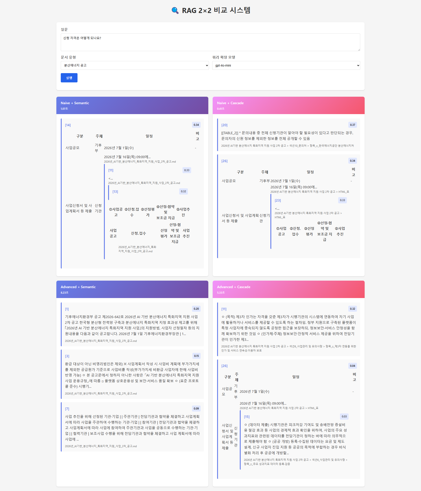

# RAG 2×2 비교 시스템 - 분산에너지 공고문

민원처리법과 분산에너지 공고문에 대해 두 가지 청킹 방식(시맨틱/계층형)과 두 가지 RAG 방식(Naive/Advanced)의 조합으로 검색 품질을 비교하는 시스템입니다.

## 시스템 개요



### 비교 매트릭스 (2×2)

| RAG 방식 | 시맨틱 청킹 | 계층형 청킹 |
|----------|-------------|-------------|
| Naive | 단일 쿼리 → 검색 | 단일 쿼리 → 검색 |
| Advanced | 5개 쿼리 → 검색 → Rerank | 5개 쿼리 → 검색 → Rerank |

### 기술 스택

- **쿼리 확장**: OpenRouter DeepSeek (`deepseek/deepseek-chat-v3.1`)
- **임베딩**: OpenAI `text-embedding-3-small` (1536차원)
- **Rerank**: Cohere `rerank-multilingual-v3.0` (Top-3)
- **벡터 DB**: Supabase (pgvector)
- **백엔드**: Flask (Python)
- **프론트엔드**: 순수 HTML/CSS/JS

## 빠른 시작

### 1. 환경 설정

```bash
# 의존성 설치
pip install flask python-dotenv openai supabase cohere chonkie

# .env 파일 생성
cp .env.example .env
# .env에 API 키 입력
```

### 2. Supabase 설정

Supabase SQL Editor에서 다음 스크립트 실행:
- `setup_energy_tables.sql` (분산에너지 테이블 생성)
- `setup_match_function.sql` (민원처리법 테이블, 이미 있는 경우)

### 3. 문서 처리

```bash
# 청킹
python hierarchical_chunking_energy.py  # 계층형 (49개 청크)
python simple_chunking_energy.py         # 시맨틱 (37개 청크)

# 업로드
python upload_energy_hierarchical.py
python upload_energy_semantic.py
```

### 4. Flask 실행

```bash
python app.py
# 브라우저에서 http://localhost:5000 접속
```

## 프로젝트 구조

```
RAG_pipe/
├── config.py                         # 클라이언트 초기화
├── rag_components.py                 # RAG 핵심 컴포넌트
├── app.py                            # Flask 백엔드
├── templates/
│   └── index.html                    # 2×2 비교 UI
├── hierarchical_chunking_energy.py   # 계층형 청킹
├── simple_chunking_energy.py         # 시맨틱 청킹 (간단 버전)
├── upload_energy_hierarchical.py     # 계층형 업로드
├── upload_energy_semantic.py         # 시맨틱 업로드
├── setup_energy_tables.sql           # Supabase 스크립트
└── 2026년_AI기반_분산에너지_특화지역_지원_사업_2차_공고.md  # 원본 문서
```

## ⚠️ 기술적 한계

### 1. 메모리 제약으로 인한 청킹 방식 변경

**현상**: 
- 개발 환경: 노트북 8GB RAM
- BGE-M3 SemanticChunker 실행 시 메모리 부족으로 16분 이상 진행되지 않음
- 시맨틱 청킹을 단순 토큰 기반 청킹(`simple_chunking_energy.py`)으로 대체

**영향**:
- **시맨틱 vs 계층형 비교의 공정성 저하**: 시맨틱 청킹이 의도했던 "의미 기반 분할"이 아닌 단순 토큰 수 기반 분할로 대체되어, 두 청킹 방식의 본질적 비교가 불가능
- **청크 품질 저하**: 토큰 수로만 자르다 보니 문맥이 중간에 끊기는 현상 발생
- **청크 크기 불균형**: 1000 토큰 기준으로 자르다 보니 중요한 정보가 여러 청크에 분산되거나, 작은 정보가 독립된 청크로 됨

**원인**:
```python
# 기존 시맨틱 청킹 (작동 안 함)
from chonkie import SemanticChunker, SentenceTransformerEmbeddings
embeddings = SentenceTransformerEmbeddings("BAAI/bge-m3")  # 큰 모델
chunker = SemanticChunker(embedding_model=embeddings, chunk_size=1024)

# 대체안: 단순 토큰 기반 청킹
CHUNK_SIZE = 1000  # 토큰 수
# 문단 단위로 분할 후 토큰 수로만 청킹
```

### 2. HTML 테이블 과다로 인한 파싱 어려움

**현상**:
- 분산에너지 공고문에 28개의 HTML `<table>`이 포함
- 마크다운 테이블과 HTML 테이블이 혼재
- 복잡한 셀 구조 (rowspan, colspan, 중첩 테이블)

**파싱 전략**:
```python
# HTML 표를 placeholder로 치환 후 청킹
tables = re.findall(r"<table>.*?</table>", text, re.DOTALL)
for i, t in enumerate(tables):
    text = text.replace(t, f"\n[[TABLE_{i}]]\n")

# 청킹 후 각 표를 별도 청크로 저장
```

**영향**:
- **표-본문 맥락 단절**: 표가 별도 청크로 분리되어 주변 텍스트와의 맥락이 끊어짐
- **정보 파편화**: 예를 들어 "지원금액" 표가 주변 설명 없이 독립 청크로 존재
- **검색 품질 저하**: 사용자가 "지원금액"을 물으면 표 내용만 나오고, 그 앞뒤 설명(지원 대상, 신청 자격 등)이 함께 나오지 않음

**예시**:
```
[청크 1] 사업목적, 지원근거 설명
[청크 2] <table>지원금액 표</table>  # 맥락 없이 독립
[청크 3] 지원대상, 신청절차 설명
```

### 3. 쿼리 확장 기능 미작동

**현상**:
- DeepSeek `deepseek/deepseek-chat-v3.1`가 5개 확장 질문을 모두 동일하게 반환
- `response_format={"type":"json_object"}` 미지원 모델이라 폴백 로직이 작동하지만 결과가 기대와 다름

**실제 출력**:
```json
{
  "expanded_queries": [
    "지원금액은 얼마인가요?",
    "지원금액은 얼마인가요?",
    "지원금액은 얼마인가요?",
    "지원금액은 얼마인가요?",
    "지원금액은 얼마인가요?"
  ]
}
```

**영향**:
- Advanced RAG의 핵심 장점(다양한 표현으로 검색 범위 확장)이 작동하지 않음
- Naive vs Advanced 비교의 의미가 퇴색
- Multi-Query가 단일 쿼리와 실질적으로 동일해짐

### 4. 청킹 메타데이터 구조 불일치

**시맨틱 청킹** (단순 버전):
```json
{
  "chunk_id": 0,
  "text": "...",
  "token_count": 992,
  "source": "2026년...공고.md"
}
```

**계층형 청킹**:
```json
{
  "chunk_id": 1,
  "doc_title": "2026년...공고",
  "section_no": "1",
  "section_title": "사업개요",
  "item_marker": "□_사업목적 : ...",
  "source_path": "문서명 > 섹션1_사업개요 > 항목_□...",
  "doc_type": "energy",
  "notice_no": "2026-642",
  "chunking_type": "cascade"
}
```

**영향**:
- 두 청킹 방식의 메타데이터 구조가 완전히 달라 검색 결과 표시 시 불일치
- 계층형은 섹션/항목 정보가 풍부하지만 시맨틱은 source 필드만 존재
- UI에서 메타데이터 표시 방식을 통일해야 하는 문제 발생

## 📊 테스트 결과 예시

### 질문: "지원금액은 얼마인가요?"

| 조합 | 실행시간 | 최상위 결과 | 점수 |
|------|----------|-------------|------|
| Naive + Semantic | 2.9초 | 표 데이터 (지원금 관련) | 0.41 |
| Naive + Cascade | 0.5초 | 표 데이터 (지원금 관련) | 0.41 |
| Advanced + Semantic | 7.3초 | 지원제외 사항 전체 텍스트 | 0.19 |
| Advanced + Cascade | 8.1초 | **"사업별 최대 정부 지원금: 최대 50억원 이내"** | 0.64 |

## 🔧 해결 방안 (제안)

### 1. 메모리 문제 해결
- **단기**: 더 가벼운 임베딩 모델 사용 (예: `sentence-transformers/all-MiniLM-L6-v2`)
- **장기**: 클라우드 환경에서 실행하거나, 임베딩 계산은 별도 서버에서 수행

### 2. 테이블 파싱 개선
- **표 병합 전략**: 표 직전의 설명 텍스트를 같은 청크에 포함
- **표 요약**: 표 전체를 하나의 청크로 하되, 메타데이터에 키 내용 요약

### 3. 쿼리 확장 개선
- **모델 변경**: JSON 모드를 지원하는 모델 사용 (gpt-4o-mini 등)
- **프롬프트 개선**: DeepSeek용 별도 프롬프트 작성

### 4. 메타데이터 통일
- 시맨틱 청킹에도 섹션/항목 정보를 추출하는 로직 추가
- 또는 계층형 청킹의 메타데이터를 단순화하여 일치시킴

## 📝 API 문서

### GET /
메인 페이지 렌더링

### GET /api/config
```json
{
  "default_model": "deepseek/deepseek-chat-v3.1",
  "llm_models": ["deepseek/deepseek-chat-v3.1", "gpt-4o-mini"],
  "doc_types": [
    {"value": "civil", "label": "민원처리법"},
    {"value": "energy", "label": "분산에너지 공고"}
  ]
}
```

### POST /api/compare
```json
{
  "question": "지원금액은 얼마인가요?",
  "doc_type": "energy",
  "query_model": "deepseek/deepseek-chat-v3.1"  // 선택적
}
```

## 📄 라이선스

MIT License

---

**개발자**: Jung SONG  
**GitHub**: wookiesong/RAG_test  
**개발 환경**: Python 3.12, Flask, OpenRouter DeepSeek, Supabase (pgvector)  
**하드웨어**: 노트북 8GB RAM (메모리 제약으로 인한 기능 제약 있음)
